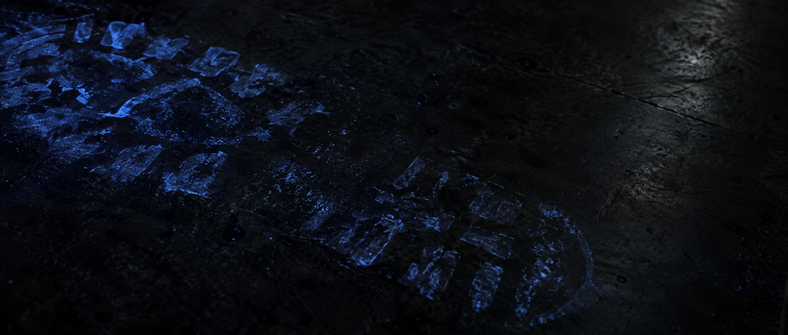

<picture>
  <source media="(prefers-color-scheme: dark)" srcset="./assets/hero-dark.png">
  
</picture>

# Luminol

**Stop guessing. Find what reality contradicts.**


Luminol investigates an expectation/reality gap by freezing the witness,
keeping competing hypotheses alive, running the smallest discriminator, and
changing the proven seam instead of papering surprise over with a confident
patch.

The recognizable failure is urgency or blame selecting the first plausible
cause, then shipping a patch with no proven mechanism while the surprise recurs.

```sh
npx skills add subcreation/luminol -g
```

## Evidence

> **Benchmark in progress.** This panel will compare **candidate fixes that
> survive independent reality-based retest** using the same task, model, effort,
> tools, and starting state with and without Luminol. Until the fixtures, raw
> runs, and reproduction steps are published, this project claims no efficacy
> percentage.

The planned corpus, scoring gate, telemetry, and collection status are in
[benchmarks/README.md](./benchmarks/README.md).

**Field record** (observational, not a benchmark)

From the private work records of the agent team that builds Current, July 12 to
August 25, 2026. The team marks a Mystery resolved only after its fix survives a
later live or independent retest; a passing test is not enough. That bar
mattered: in at least 16 Mysteries, a fix or resolution that had already passed
its own checks was later overturned by reality. Of the 73 Mysteries opened after
the method was adopted, 37 have met the bar. The rest stay open until a later
run confirms them, rather than being closed on a passing test (one was withdrawn
as not a defect). These are field observations from private team records, not a
controlled with/without comparison.

## Before And After

Without an investigation discipline:

```text
Claim: Fixed the timeout.
Reality: A plausible cause was patched; the expected/observed witness and seam
         were never established.
```

With Luminol:

```text
Witness: Expected and observed reality are frozen.
Status:  Timeout is one hypothesis; its discriminator is preserved.
Seam:    Unproven.
State:   Mystery; no CANDIDATE yet.
```

## How It Works

1. **Freeze the witness.** Record the exact expected and observed reality.
2. **Gather present evidence.** Use existing records and the smallest telemetry
   needed to distinguish explanations.
3. **Keep hypotheses alive.** Name competing causes and their discriminators.
4. **Run the smallest discriminator.** Preserve one deterministic red
   reproduction, then change the proven shared seam.
5. **Keep uncertainty visible.** A deterministic proof supports CANDIDATE;
   RESOLVED requires later independent or live non-recurrence.

## Guardrails

- An unexplained gap remains a Mystery, not a confidently named defect.
- Literal failure evidence stays visible; disconfirming evidence is progress.
- The first plausible patch is not a proven cause.
- Luminol is not title grammar, a parser, status machine, retry policy,
  permission layer, or workflow engine.
- Adaptive investigation rigor (lighter or deeper per Mystery) is a roadmap
  proposal, not present behavior.

## Philosophy

Read the full [Luminol philosophy](./references/philosophy.md). Surprise and
uncertainty remain visible until reality supports a conclusion.

## Present Boundary

Luminol v0.1 is a software-development investigation discipline.
It draws on repository state, process trees, logs, controlled fixtures, and
production seams. Its host-neutral core is preserving an expectation/reality
gap and testing its mechanism; adaptive rigor, broader domain specializations,
and measured survival claims remain post-release work.

This public edition matches the skill used inside Current, except that its
ownership section names generic roles instead of internal team names. The
philosophy reference is unchanged.

## Installation

Install globally for every compatible agent the installer detects:

```sh
npx skills add subcreation/luminol -g
```

Omit `-g` to install into the current project instead. To list the skill
without installing it:

```sh
npx skills add subcreation/luminol --list
```

To install from a local clone:

```sh
git clone https://github.com/subcreation/luminol.git
npx skills add ./luminol -g
```

## Update

```sh
npx skills update luminol -g -y
```

For reproducible setups, pin a tagged release instead of following the default
branch, for example:

```sh
npx skills add https://github.com/subcreation/luminol/tree/v0.1.0 -g
```

## Uninstall

```sh
npx skills remove luminol -g -y
```

## Compatibility

Luminol is packaged as a root Agent Skill with optional OpenAI interface
metadata. Before release, the isolated project lifecycle exercise on the
packaging candidate recorded:

| Agent | Packaging evidence |
| --- | --- |
| Codex | The installer copied the candidate root skill and its `references/philosophy.md` into the isolated project. |
| Claude Code | The installer copied the candidate root skill and its `references/philosophy.md` into the isolated project. |

All-agent uninstall left an empty installer registry (`skills-lock.json` with no skills) and no installed skill or philosophy artifact in either client path.

These checks concern package placement and lifecycle, not Luminol behavior or
efficacy. Other Agent Skills clients may discover the root `SKILL.md`, but
remain unverified.

## Troubleshooting

**The patch did not hold.** A proven deterministic correction awaiting later
exposure is CANDIDATE, not RESOLVED. An unproven mechanism, or a recurrence
that contradicts the candidate, remains or reopens a Mystery.

**The team agrees on a cause without a witness.** Preserve exact expected and
observed evidence, then state competing hypotheses and a discriminator.

**The evidence is quiet.** A quiet run with no exposure is unmeasured, not
stable.

**A title is being used as an investigation record.** Keep the investigation
with Luminol; Throughline owns Story and Mystery title grammar.

## Project

- Read the [roadmap](./ROADMAP.md).
- Read the [Luminol philosophy](./references/philosophy.md).
- Inspect or contribute to the [benchmark plan](./benchmarks/README.md).
- Read [CONTRIBUTING.md](./CONTRIBUTING.md) before proposing a behavior change.
- Review the portfolio [art direction](./assets/ART_DIRECTION.md).

Luminol was built alongside Current, an open-source multi-agent harness (coming
soon).

Luminol is licensed under the [Apache License 2.0](./LICENSE).
